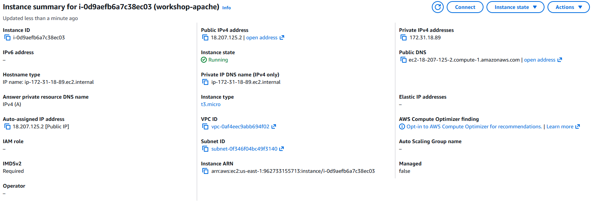
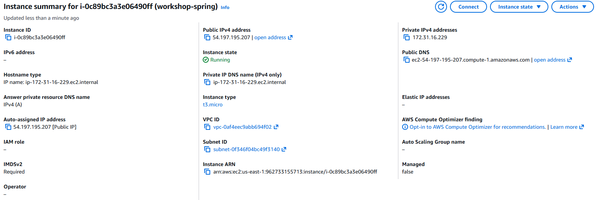
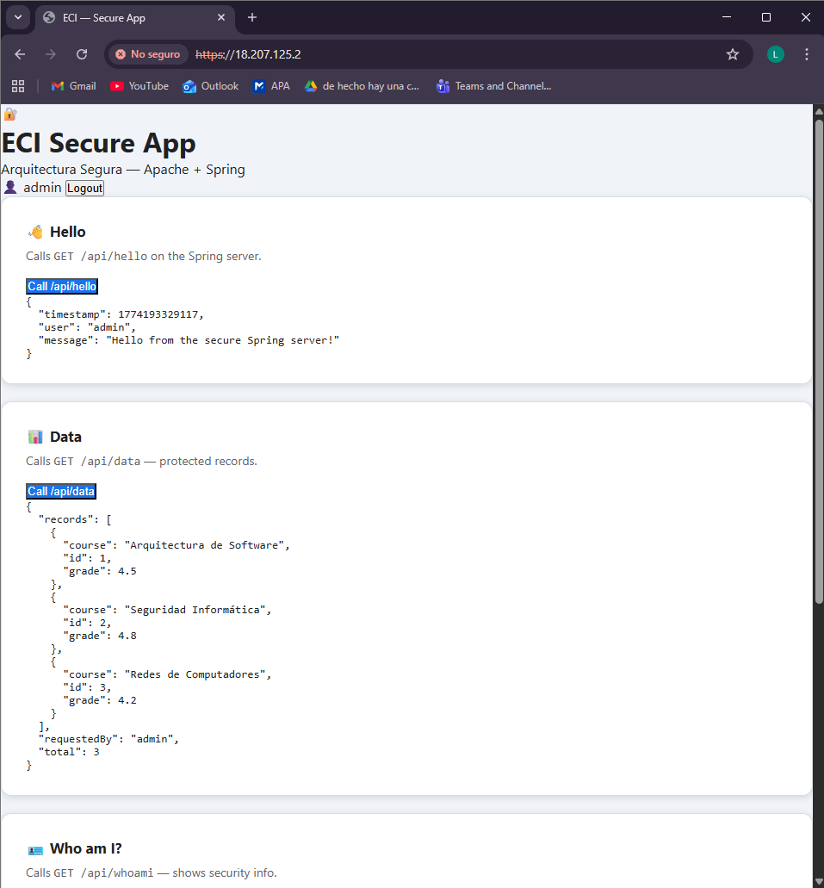
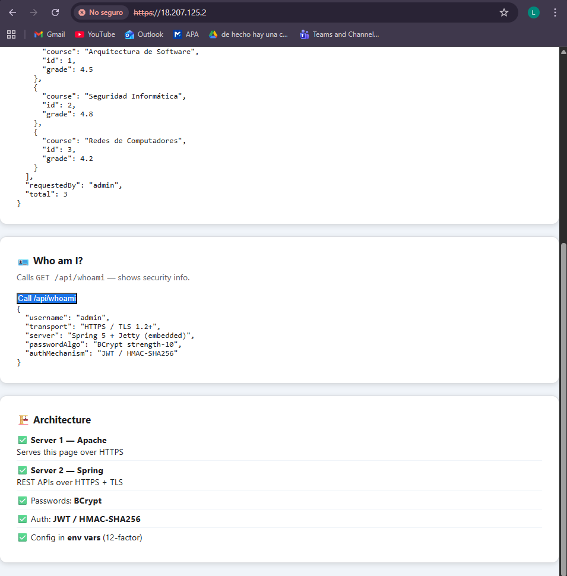
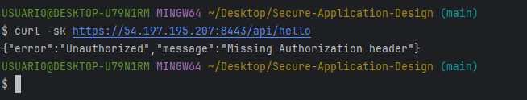
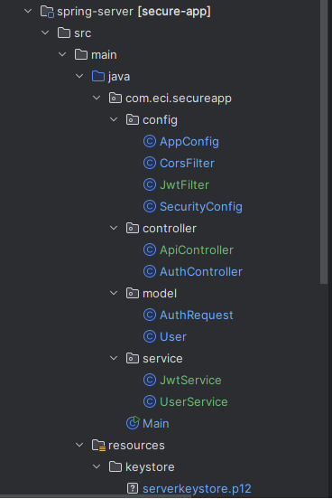

# Secure App — ECI Arquitectura Segura

**Estudiante:** Laura Natalia Perilla Quintero

Este laboratorio implementa una aplicación web segura desplegada en AWS con dos servidores separados. El Servidor 1 es Apache, que entrega al navegador una interfaz web construida con HTML, CSS y JavaScript asíncrono sobre una conexión HTTPS cifrada. El Servidor 2 es Spring Framework, que expone una API REST protegida con TLS, autenticación por tokens JWT y almacenamiento de contraseñas con BCrypt.

El usuario accede al cliente web desde Apache, inicia sesión con sus credenciales, y el JavaScript del navegador llama de forma asíncrona a los endpoints del servidor Spring usando el token JWT como mecanismo de autorización. Cualquier petición sin token válido es rechazada con un error 401.

Todo el proyecto sigue los principios de la metodología 12-factor app, la configuración sensible como contraseñas, rutas de keystores y secretos de firma nunca está en el código, sino en variables de entorno. Los certificados TLS se generaron con `keytool` (formato PKCS12) para Spring y con `OpenSSL` para Apache.

---

## Arquitectura

```
                        Usuario (Browser)
                              │
                              │ HTTPS (TLS, cert auto-firmado)
                              ▼
               ┌──────────────────────────────┐
               │   SERVIDOR 1 — Apache         │
               │   EC2 Amazon Linux 2023       │
               │   IP: 18.207.125.2            │
               │   Puerto: 443 (HTTPS)         │
               │                              │
               │   Sirve:                     │
               │   - index.html               │
               │   - app.js (async fetch)     │
               │   - config.js                │
               │   - styles.css               │
               └──────────────┬───────────────┘
                              │
                              │ HTTPS + JWT (async fetch API)
                              ▼
               ┌──────────────────────────────┐
               │   SERVIDOR 2 — Spring        │
               │   EC2 Amazon Linux 2023      │
               │   IP: 54.197.195.207         │
               │   Puerto: 8443 (HTTPS)       │
               │                              │
               │   Endpoints:                 │
               │   POST /api/auth/login       │
               │   POST /api/auth/register    │
               │   GET  /api/hello            │
               │   GET  /api/data             │
               │   GET  /api/whoami           │
               │   GET  /health               │
               │                              │
               │   Seguridad:                 │
               │   - TLS con PKCS12 keystore  │
               │   - BCrypt passwords         │
               │   - JWT / HMAC-SHA256        │
               │   - Spring Security 5.7      │
               └──────────────────────────────┘
```

---

## Características de Seguridad

| Característica | Implementación |
|---|---|
| Transporte cifrado | HTTPS/TLS en ambos servidores |
| Certificados | Auto-firmados (keytool PKCS12) |
| Almacenamiento de contraseñas | BCrypt strength-10 (nunca texto plano) |
| Autenticación | JWT tokens firmados con HMAC-SHA256 |
| Autorización | JwtFilter en todas las rutas `/api/*` |
| Configuración | Variables de entorno (12-factor principio III) |
| Sesión | Stateless — JWT en sessionStorage |
| Headers de seguridad | HSTS, X-Frame-Options, X-Content-Type-Options |

---

## Estructura del Proyecto

```
Secure-Application-Design/
├── spring-server/                        # Servidor 2 — Spring Framework
│   ├── pom.xml                           # Maven — Spring 5, Jetty embebido
│   └── src/main/java/com/eci/secureapp/
│       ├── Main.java                     # Arranque Jetty + HTTPS
│       ├── config/
│       │   ├── AppConfig.java            # Spring MVC
│       │   ├── SecurityConfig.java       # Spring Security + BCrypt
│       │   ├── CorsFilter.java           # CORS para el cliente Apache
│       │   └── JwtFilter.java            # Validación JWT en /api/*
│       ├── model/
│       │   ├── User.java
│       │   └── AuthRequest.java
│       ├── service/
│       │   ├── UserService.java          # Usuarios en memoria con BCrypt
│       │   └── JwtService.java           # Generación/validación JWT
│       └── controller/
│           ├── AuthController.java       # /api/auth/login, /register
│           └── ApiController.java        # /api/hello, /data, /whoami
│
├── apache-client/                        # Servidor 1 — Cliente HTML/JS
│   └── html/
│       ├── index.html                    # SPA con login y dashboard
│       ├── app.js                        # Async fetch API
│       ├── config.js                     # URLs de servidores (12-factor)
│       └── styles.css                    # Estilos
│
├── scripts/
│   ├── generate-certs.sh                 # Genera keystores con keytool
│   ├── deploy-spring.sh                  # Despliega Spring en EC2
│   └── deploy-apache.sh                  # Configura Apache en EC2
│
└── docs/
    ├── README.md                         # Este archivo
    └── architecture.md                   # Documento de arquitectura
```

---

## Guía de Despliegue Local

### Prerrequisitos

```bash
java -version    # Java 11+
mvn -version     # Maven 3.6+
keytool -help    # Incluido con el JDK
```

### Paso 1 — Generar certificado

```bash
# En Windows (Git Bash)
export PATH="$PATH:/c/Program Files/Java/jdk-17/bin"

keytool -genkeypair \
  -alias serverkeypair \
  -keyalg RSA -keysize 2048 \
  -storetype PKCS12 \
  -keystore spring-server/src/main/resources/keystore/serverkeystore.p12 \
  -storepass changeit -keypass changeit \
  -validity 3650 \
  -dname "CN=localhost, OU=ECI, O=ECI, L=Bogota, ST=Cundinamarca, C=CO" \
  -noprompt
```

### Paso 2 — Compilar

```bash
cd spring-server
mvn clean package -DskipTests
```

### Paso 3 — Iniciar servidor Spring

```bash
# En Windows (Git Bash) — pasar variables inline
KEYSTORE_PATH=src/main/resources/keystore/serverkeystore.p12 \
KEYSTORE_PASS=changeit \
KEYSTORE_ALIAS=serverkeypair \
PORT=8443 \
TOKEN_SECRET=mi-secreto-dev \
ALLOWED_ORIGIN=* \
java -jar target/secure-app-1.0.jar
```

### Paso 4 — Configurar el cliente

Edita `apache-client/html/config.js`:

```js
const CONFIG = Object.freeze({
  SPRING_URL: "https://localhost:8443",
  TOKEN_KEY:    "eci_token",
  USERNAME_KEY: "eci_user",
  TIMEOUT_MS: 10000,
});
```

### Paso 5 — Abrir cliente

1. Abre `https://localhost:8443/health` en el navegador y acepta el certificado
2. Abre `apache-client/html/index.html` en el navegador
3. Login con `admin / Admin123!`

---

## Guía de Despliegue en AWS

### Infraestructura

| Instancia | Tipo | Puertos | Propósito |
|---|---|---|---|
| eci-apache-server | t2.micro | 22, 80, 443 | Apache + Cliente HTML/JS |
| workshop-spring | t2.micro | 22, 8443 | Spring REST APIs |

### Security Groups

**eci-apache-sg:**
- SSH (22) — My IP
- HTTP (80) — 0.0.0.0/0
- HTTPS (443) — 0.0.0.0/0

**eci-spring-sg:**
- SSH (22) — My IP
- Custom TCP (8443) — 0.0.0.0/0

### Despliegue Spring (Instancia 2)

```bash
KEY=~/.ssh/tu-key.pem
SPRING_IP=54.197.195.207

# Instalar Java
ssh -i $KEY ec2-user@$SPRING_IP \
  "sudo dnf install -y java-11-amazon-corretto"

# Crear directorios
ssh -i $KEY ec2-user@$SPRING_IP \
  "mkdir -p /home/ec2-user/app/keystore"

# Copiar JAR y keystore
scp -i $KEY spring-server/target/secure-app-1.0.jar \
  ec2-user@$SPRING_IP:/home/ec2-user/app/

scp -i $KEY spring-server/src/main/resources/keystore/serverkeystore.p12 \
  ec2-user@$SPRING_IP:/home/ec2-user/app/keystore/

# Crear servicio systemd (conectarse a la instancia primero)
ssh -i $KEY ec2-user@$SPRING_IP
```

Dentro de la instancia:

```bash
printf '[Unit]\nDescription=ECI Secure App\nAfter=network.target\n\n[Service]\nType=simple\nUser=ec2-user\nWorkingDirectory=/home/ec2-user/app\nExecStart=/usr/bin/java -jar /home/ec2-user/app/secure-app-1.0.jar\nRestart=always\nEnvironment=PORT=8443\nEnvironment=KEYSTORE_PATH=/home/ec2-user/app/keystore/serverkeystore.p12\nEnvironment=KEYSTORE_PASS=changeit\nEnvironment=KEYSTORE_ALIAS=serverkeypair\nEnvironment=TOKEN_SECRET=mi-secreto-seguro\nEnvironment=ALLOWED_ORIGIN=*\n\n[Install]\nWantedBy=multi-user.target\n' | sudo tee /etc/systemd/system/secure-app.service

sudo systemctl daemon-reload
sudo systemctl enable secure-app
sudo systemctl start secure-app
```

### Despliegue Apache (Instancia 1)

```bash
KEY=~/.ssh/tu-key.pem
APACHE_IP=18.207.125.2

# Conectarse
ssh -i $KEY ec2-user@$APACHE_IP

# Dentro de la instancia:
sudo dnf install -y httpd mod_ssl
sudo systemctl start httpd
sudo systemctl enable httpd

# Generar certificado TLS
sudo openssl req -x509 -nodes -days 365 -newkey rsa:2048 \
  -keyout /etc/pki/tls/private/apache-eci.key \
  -out /etc/pki/tls/certs/apache-eci.crt \
  -subj "/C=CO/ST=Cundinamarca/L=Bogota/O=ECI/CN=18.207.125.2"
```

Subir archivos del cliente:

```bash
# Desde tu máquina local
sudo chown -R ec2-user:ec2-user /var/www/html

scp -i $KEY apache-client/html/index.html  ec2-user@$APACHE_IP:/var/www/html/
scp -i $KEY apache-client/html/config.js   ec2-user@$APACHE_IP:/var/www/html/
scp -i $KEY apache-client/html/app.js      ec2-user@$APACHE_IP:/var/www/html/
scp -i $KEY apache-client/html/styles.css  ec2-user@$APACHE_IP:/var/www/html/
```

---

## Pruebas de la API

```bash
# Health check (público)
curl -sk https://54.197.195.207:8443/health

# Login
TOKEN=$(curl -sk -X POST https://54.197.195.207:8443/api/auth/login \
  -H 'Content-Type: application/json' \
  -d '{"username":"admin","password":"Admin123!"}' \
  | python3 -c "import sys,json; print(json.load(sys.stdin)['token'])")

# Endpoint protegido CON token
curl -sk https://54.197.195.207:8443/api/hello \
  -H "Authorization: Bearer $TOKEN"

# SIN token — debe dar 401
curl -sk https://54.197.195.207:8443/api/hello
```

---

## Variables de Entorno

| Variable | Default | Descripción |
|---|---|---|
| `PORT` | `8443` | Puerto HTTPS |
| `KEYSTORE_PATH` | `src/.../serverkeystore.p12` | Ruta al keystore PKCS12 |
| `KEYSTORE_PASS` | `changeit` | Contraseña del keystore |
| `KEYSTORE_ALIAS` | `serverkeypair` | Alias del certificado |
| `TOKEN_SECRET` | (dev fallback) | Secreto para firmar JWT — **cambiar en producción** |
| `ALLOWED_ORIGIN` | `*` | Origen permitido para CORS |

---

## Usuarios por Defecto

| Usuario | Contraseña | Rol |
|---|---|---|
| `admin` | `Admin123!` | ROLE_ADMIN |
| `student` | `Student123!` | ROLE_USER |

> Las contraseñas se almacenan como hashes BCrypt. Nunca en texto plano.

---

---

## Screenshots del Laboratorio

### Instancia 1 — Apache Server (workshop-apache)
**IP Pública:** 18.207.125.2 | **Estado:** Running



---

### Instancia 2 — Spring Server (workshop-spring)
**IP Pública:** 54.197.195.207 | **Estado:** Running



---

### Cliente HTTPS sobre Apache + Dashboard con APIs funcionando
El cliente HTML/JS se sirve desde Apache sobre HTTPS (`https://18.207.125.2`).  
El usuario `admin` está autenticado con JWT. Se muestran las respuestas de  
`/api/hello`, `/api/data` y `/api/whoami` — protegidas por el `JwtFilter` en Spring.





---

### Endpoint sin token → 401 Unauthorized
Llamada directa a `https://54.197.195.207:8443/api/hello` sin header  
`Authorization`. El `JwtFilter` rechaza la petición con **401 Unauthorized**  
y el mensaje `"Missing Authorization header"`. Demuestra que los endpoints  
están correctamente protegidos.



---

### Estructura del Proyecto en el IDE
Estructura completa del proyecto mostrando todos los paquetes Java:  
`config` (AppConfig, CorsFilter, JwtFilter, SecurityConfig),  
`controller` (ApiController, AuthController),  
`model` (AuthRequest, User),  
`service` (JwtService, UserService) y el keystore PKCS12.



---

## Video de Demostración

El siguiente video demuestra el despliegue completo de la aplicación en AWS y explica las características de seguridad implementadas:

[2026-03-22 14-07-08.mkv](../video/2026-03-22%2014-07-08.mkv)

**El video cubre:**
- Las 2 instancias EC2 corriendo en AWS
- Cliente web servido por Apache sobre HTTPS
- Login con autenticación BCrypt
- Llamadas a los endpoints protegidos con JWT
- Demostración del 401 sin token
- Explicación de las características de seguridad: TLS, BCrypt, JWT, 12-factor


## Tecnologías Usadas

| Tecnología | Versión | Propósito |
|---|---|---|
| Java | 11 | Lenguaje de programación |
| Spring Framework | 5.3.27 | Framework web (sin Spring Boot) |
| Spring Security | 5.7.8 | Seguridad y BCrypt |
| Jetty | 9.4.51 | Servidor embebido (sin app server externo) |
| Maven | 3.8+ | Gestión de dependencias |
| Apache httpd | 2.4.66 | Servidor web para el cliente |
| BCrypt | strength-10 | Hash de contraseñas |
| JWT | HMAC-SHA256 | Tokens de autenticación |
| PKCS12 | RSA 2048 | Formato del keystore TLS |
| Amazon Linux | 2023 | Sistema operativo EC2 |

---

## Referencias

- Spring Framework 5.3: https://docs.spring.io/spring-framework/docs/5.3.x/reference/html/
- Spring Security 5.7: https://docs.spring.io/spring-security/reference/5.7/
- AWS AL2023 LAMP Setup: https://docs.aws.amazon.com/linux/al2023/ug/ec2-lamp-amazon-linux-2023.html
- keytool Oracle docs: https://docs.oracle.com/en/java/javase/11/tools/keytool.html
- 12-factor App: https://12factor.net/
- Taller Arquitectura Segura — Luis Daniel Benavides Navarro
